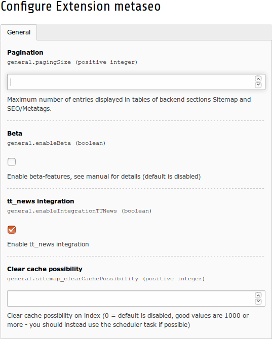

.. ==================================================
.. FOR YOUR INFORMATION
.. --------------------------------------------------
.. -*- coding: utf-8 -*- with BOM.

.. include:: ../Includes.txt

.. _admin-manual:

Administrator Manual
====================

Installation via extension manager
----------------------------------

- Update the extension manager's extension list
- Install the extension `metaseo` via extension manager.
- Include “static extension template” (Template → Info/Modify → Edit the whole template record → “Include static
  (from extensions):” and select “MetaSEO”)
- Modify your metatags via constants editor

Installation via composer
-------------------------

- Make sure that you have a recent version of composer installed
- Make sure that you have TYPO3 CMS installed in composer mode
- `cd` to the path with your `composer.json`
- To install via TER (recommended default), run `composer require typo3-ter/metaseo -o`
- To install via Packagist (for enthusiasts), run `composer require mblaschke/metaseo -o`
- If asked for a version constraint, answer with `*`
- Include “static extension template” (Template → Info/Modify → Edit the whole template record → “Include static
  (from extensions):” and select “MetaSEO”)
- Modify your metatags via constants editor

Migration from TYPO3 CMS 7.6 to 8.7
-----------------------------------

- Check out the latest `announcements <https://github.com/mblaschke/TYPO3-metaseo/issues/376>`_.

Migration from TYPO3 CMS 6.2 to 7.6
-----------------------------------

- Upgrade the extension `metaseo` to the latest 2.x version, still using TYPO3 CMS 6.2.
- Clear all caches in the install tool
- You are now ready to go for TYPO3 CMS 7.6

Migration from extension tq_seo
-------------------------------

Before you start the migration, there's two important things to know:

- The migration helper extension `metaseo_tqseo_import` is available for TYPO3 CMS 6.2 only. That said, please make
  sure to migrate to `metaseo` *before* upgrading to later versions of TYPO3 CMS.
- `metaseo` 2.0.0 contains schema updates which the migration helper extension `metaseo_tqseo_import` is not aware of.
  That said, please also make sure that you *don't* install `metaseo` 2.0.0 or later before you migrate.

To migrate from `tq_seo` to `metaseo` please follow these steps:

- Make sure that you use TYPO3 CMS 6.2
- Update the extension manager's extension list
- Update `tq_seo` to version 6.0.1.
- Clear all caches using the install tool.
- Update your database schema using the install tool.
- Uninstall or disable the extension `tq_seo`. Don't update your database schema.
- Install the extension `metaseo` *1.0.8* via extension manager. Installing later versions of `metaseo` will break
  the migration process.
- Include “static extension template” (Template → Info/Modify → Edit the whole template record → “Include static
  (from extensions):” and select “MetaSEO”)
- Install the extension `metaseo_tqseo_import` and run the importer.
- Uninstall or disable the extension `metaseo_tqseo_import`
- Update your database schema using the install tool.
- Upgrade the extension `metaseo` to the latest 2.x version, still using TYPO3 CMS 6.2.
- Modify your metatags via constants editor

Indexed Sitemap
---------------

The sitemap will automatically collect all cacheable sites and provides a XML- and plaintext-output – that's why it is “indexed”.

The XML-Sitemap (eg. for Google) is available with: `index.php?type=841132`
The TXT-Sitemap is available with: `index.php?type=841131`

If you have more than one tree in your TYPO3 you will have to add the root-PID to your Sitemap, e.g.:

- Tree #1 with `PID 123`: `index.php?id=123&type=841132`
- Tree #2 with `PID 234`: `index.php?id=234&type=841132`

If you have also enabled `sitemap_ObeySysLanguage` in the extension configuration you also have to add the language-id for your Sitemap - eg. for separated language-domain e.g. `example.com` (only english pages) and `example.de` (only german pages).

The sitemap will index ALL cacheable pages with full extension support (like `tt_news` and all other “clean” extensions).
If your extension doesn't use `cHash` or uses `no_cache` the output will *not* be included in the sitemap (and also will not be indexed by `index_search`).

The sitemap indexes all generated typoLinks (BETA).

**Warning:**
The MetaSEO sitemap relies on the TYPO3 caching system. If an extension (or configuration – e.g. `RealURL` configuration) breaks the caching system and makes `TSFE` non-cacheable (`TSFE->no_cache`) the corresponding pages will *not* be indexed.
Make sure no extension will set `no_cache` and the `cHash` of your link is valid. This is the only way to get just valid URLs into your sitemap.

This sitemap supports both, `pibase` and `extbase` extensions without problems. However the developer must take care of the `cHash`-handling.

Robots.txt
----------
The robots.txt can be generated with type `841133`, e.g.:
`index.php?type=841133`

If possible and enabled the `robots.txt` builder will automatically add the link to the sitemap generator or the static sitemap files (will require TYPO3 scheduler task to generate the static sitemap).

Scheduler Tasks
---------------

=============================================   ===============================================================   ======================
Scheduler Task                                  Description                                                       Frequency
=============================================   ===============================================================   ======================
MetaSEO Cleanup                                 This task cleans up old database entries in the                   One run per day
                                                tx_metaseo_sitemap table.

MetaSEO `sitemap.txt` builder                   This task builds a real `sitemap.txt` file in the                 One run per day
                                                upload directory.

                                                - Directory: `uploads/tx_metaseo/sitemap_txt/`
                                                - Sitemap: `sitemap-r{ROOTPID}.txt.gz`

                                                If language domain support is active:

                                                - Sitemap: `sitemap-r{ROOTPID}-l{LANG}.txt.gz`

                                                `{ROOTPID}` is the Page-UID from the root pages in
                                                your TYPO3 installations.

                                                `{LANG}` is the language id (only active if language
                                                domains are active).

                                                Hint: These files are already gzipped.

MetaSEO `sitemap.xml` builder                   This task builds a real `sitemap.xml` files in the                One run per day
                                                upload directory.

                                                - Directory: `uploads/tx_metaseo/sitemap_xml/`
                                                - Sitemap-Index: `index-r{ROOTPID}.xml.gz`
                                                - Sitemap-Page: `sitemap-r{ROOTPID}-p{PAGE}.xml.gz`

                                                If language domain support is active:

                                                - Sitemap-Index: `index-r{ROOTPID}-l{LANG}.xml.gz`
                                                - Sitemap-Page: `sitemap-r{ROOTPID}-l{LANG}-p{PAGE}.xml.gz`

                                                `{ROOTPID}` is the Page-UID from the root pages in your
                                                TYPO3 installations.

                                                `{PAGE}` is the current page of the sitemap.

                                                `{LANG}` is the language id (only active if language
                                                domains are active).

                                                The index will refer to all page sitemaps so you only
                                                have to reference to the sitemap index.

                                                Hint: These files are already gzipped.
=============================================   ===============================================================   ======================

RealURL Configuration
---------------------

If you want to activate a “real” `sitemap.xml` feature (eg. `http://example.com/sitemap.xml`), configure `RealUrl` like this:

::

        <?php
        $TYPO3_CONF_VARS['EXTCONF']['realurl']['_DEFAULT'] = array(

        'init' => array(
            // ...
        ),

        'preVars' => array(
            // ...
        ),

        'fixedPostVars' => array(
            // ...
        ),

        'postVarSets' => array(
            '_DEFAULT' => array(

                // TT-NEWS (example configuration)
                'date' => array(
                    array(
                        'GETvar' => 'tx_ttnews[year]' ,
                    ),
                    array(
                        'GETvar' => 'tx_ttnews[month]' ,
                        'valueMap' => array(
                            'january' => '01',
                            'february' => '02',
                            'march' => '03',
                            'april' => '04',
                            'may' => '05',
                            'june' => '06',
                            'july' => '07',
                            'august' => '08',
                            'september' => '09',
                            'october' => '10',
                            'november' => '11',
                            'december' => '12',
                        ),
                    ),
                    array(
                        'GETvar' => 'tx_ttnews[day]',
                    ),
                ),

                // news pagebrowser
                'browse' => array(
                    array(
                        'GETvar' => 'tx_ttnews[pointer]',
                    ),
                ),

                // news categories
                'news-category' => array (
                    array(
                        'GETvar' => 'tx_ttnews[cat]',
                        'lookUpTable' => array(
                            'table' => 'tt_news_cat',
                            'id_field' => 'uid',
                            'alias_field' => 'title',
                            'addWhereClause' => ' AND NOT deleted',
                            'useUniqueCache' => 1,
                            'useUniqueCache_conf' => array(
                                'strtolower' => 1,
                                'spaceCharacter' => '-',
                            ),
                        ),
                    ),
                ),

                // news articles
                'article' => array(
                    array(
                        'GETvar' => 'tx_ttnews[tt_news]',
                        'lookUpTable' => array(
                            'table' => 'tt_news',
                            'id_field' => 'uid',
                            'alias_field' => 'title',
                            'addWhereClause' => ' AND NOT deleted',
                            'useUniqueCache' => 1,
                            'useUniqueCache_conf' => array(
                                'strtolower' => 1,
                                'spaceCharacter' => '-',
                            ),
                        ),
                    ),
                ),

                // ... other extensions ...
            ),
        ),

        'fileName' => array(
            'defaultToHTMLsuffixOnPrev' => 1,
            'index' => array(
                // ...

                'sitemap.xml' => array(
                    'keyValues' => array(
                        'type' => 841132,
                    ),
                ),

                'sitemap.txt' => array(
                    'keyValues' => array(
                        'type' => 841131,
                    ),
                ),

                'robots.txt' => array(
                    'keyValues' => array(
                        'type' => 841133,
                    ),
                ),

                '_DEFAULT' => array(
                    'keyValues' => array(
                        'type' => 0,
                    )
                ),

            ),
        ),

        'pagePath' => array(
            'type' => 'user',
            'userFunc' => 'EXT:realurl/class.tx_realurl_advanced.php:&tx_realurl_advanced->main',
            'spaceCharacter'    => '-',
            'segTitleFieldList' => 'tx_realurl_pathsegment,alias,nav_title,title',
            'languageGetVar'    => 'L',
            'expireDays'        => 30,
            'rootpage_id'       => 1,
        ),

        );

Configuration via Extension Manager
-----------------------------------

In TYPO3's extension manager go to the configuration symbol besides the entry for MetaSEO:

=================================   ==========================================================
Configuration variable              Description
=================================   ==========================================================
`general.pagingSize`                Pagination: Maximum number of entries displayed per page
                                    in tables of backend sections Sitemap and SEO/Metatags.
                                    Defaults to 50 entries per page.

`general.enableBeta`                Enable or disable beta features.

`general.enableIntegrationTTNews`   Enable or disable `tt_news` integration.

`general.sitemap_`                  to be documented.
`clearCachePossibility`
=================================   ==========================================================
