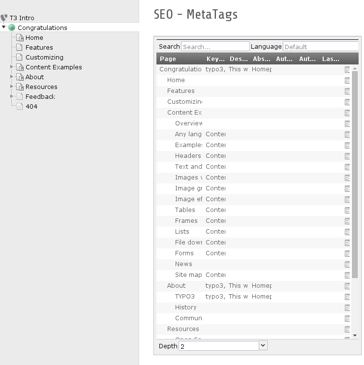
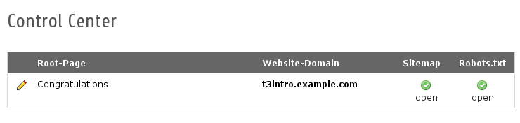
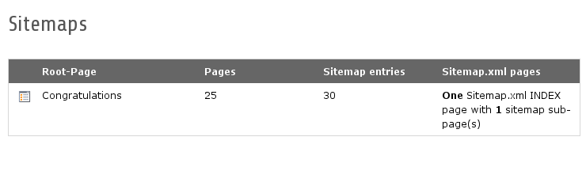

.. ==================================================
.. FOR YOUR INFORMATION
.. --------------------------------------------------
.. -*- coding: utf-8 -*- with BOM.

.. include:: ../Includes.txt

.. _users-manual:

Backend Modules
=========

SEO Page Module (Website -> SEO)
--------------------------------

The SEO page module provies an overview for all seo relevant informations (including possibility to edit this informations on click).

==============================   ==========================================================
Module                           Description
==============================   ==========================================================
Metatags                         Overview for all relevant metatags

Geo position                     Overview for geo positioning

SearchEngines                    Overview for all relevant search engine settings
                                 including sitemap stuff

URL Handling                     Overview for all relevant url handling stuff including
                                 RealURL support and possibility to simulate the url.

Pagetitle                        Overview for all relevant pagetitle informations and
                                 possibility to simulate the pagetitle.

Pagetitle simulator (Slow!)      Simulates the pagetitle generation for the current
                                 selected tree.
==============================   ==========================================================

SEO Control Center (SEO -> Control Center)
-----------------------------------------

The SEO control center lists all your root-pages in your TYPO3 installation. For each root page you can control specific sitemap and robots.txt settings.

SEO Sitemap (SEO -> Sitemap)
----------------------------

The SEO sitemap module provides access to the indexed sitemap list.