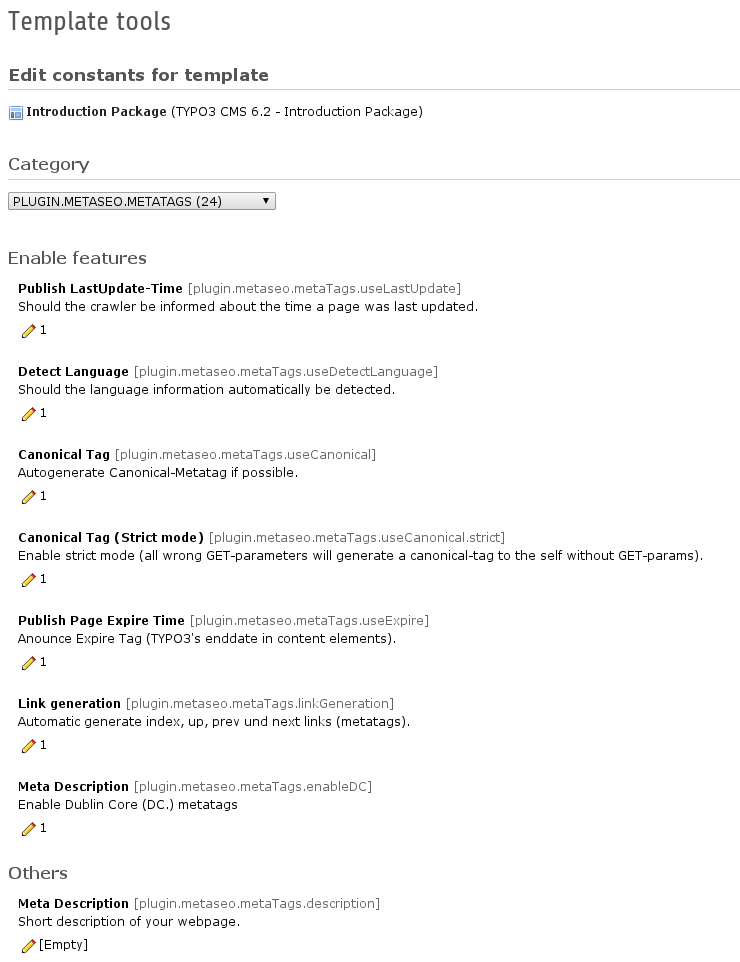
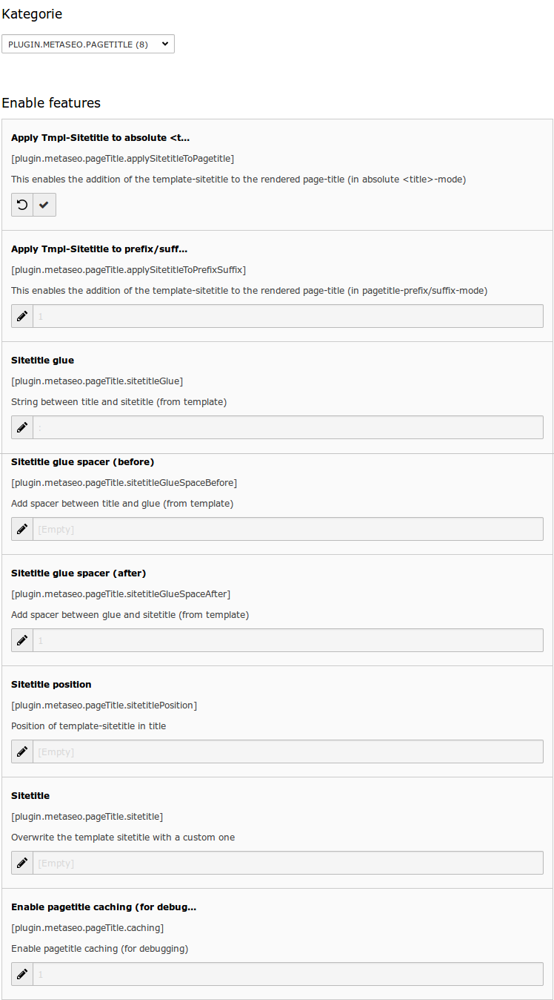
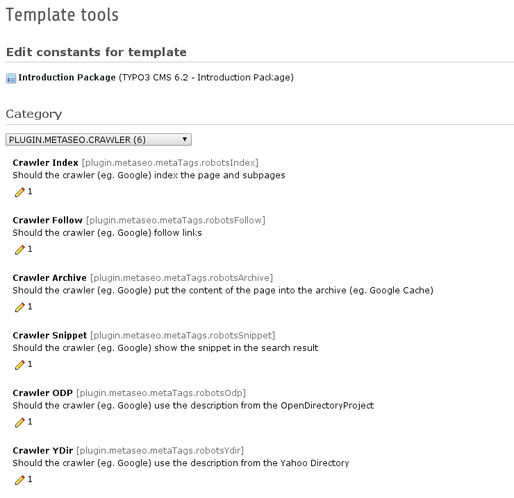
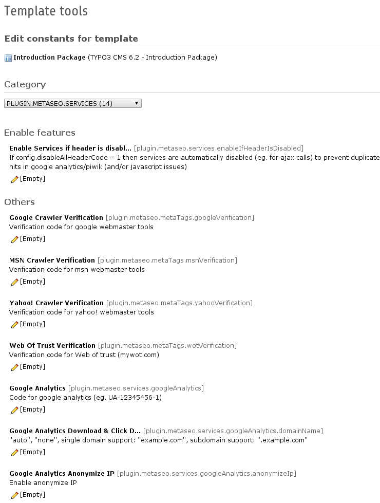

.. ==================================================
.. FOR YOUR INFORMATION
.. --------------------------------------------------
.. -*- coding: utf-8 -*- with BOM.

.. include:: ../Includes.txt

What does it do?
================

This extensions handles multiple page metatags and pagetitle manipulations in TYPO3. It's a replacement and major improvement for the “metatags” and this extension is the successor of the popular "tq_seo" extension.

The following features are supported:

- Indexed XML sitemap for Google and other search engines (with support for ALL extensions, pibase and extbase, not only tt_news)
- Real sitemap builder via TYPO3 scheduler
- Metatags
- Manipulation of Metatags via stdWrap (Beta)
- Automatic fetching metatags from tt_news (single-display module)
- Pagetitle manipulations
- Manipulation of pagetitle via stdWrap (Beta)
- Multi-language and/or multi-tree TYPO3 installations

Backend modules:

- SEO page module
- SEO control center module
- SEO sitemap module

The following metatags are supported:

- Language (auto-detected)
- Description
- Keyword
- Copyright information
- Reply-To E-Mail-Address
- Author and publisher
- Rating and distribution
- Revisit
- Geo-location information
- Searchengine crawler instructions
- Google Analytics (asynchronous, with anonymized IP and download link tracking)
- Piwik integration (asynchronous)
- Google, MSN, Yahoo and WebOfTrust Verification
- Google+ Direct Connect
- Canonical URL (custom URL or autogenerated for current page)
- IE Compatibility-Mode
- Google Expire Date
- Index, up, prev und next link-metatags
- P3P-HTTP-Headers
- OpenGraph (WIP)
- Blacklist for sitemap, CanonicalURL and searchengine index/noindex switching

The following pagetitle transformations are supported:

- Prefix and suffix (inheritable)
- Absolute pagetitle without any prefix and suffix
- Sitetitle glue options
- Sitetitle positon

Screenshots
-----------

Backend Modules
^^^^^^^^^^^^^^^
.. figure:: ../Images/Introduction/ModuleSeoMetatags.png
    :scale: 80%
    :alt: Backend Module - SEO Metatags

    Backend Module "SEO Metatags"

.. figure:: ../Images/Introduction/ModuleSeoControlCenter.png
    :scale: 80%
    :alt: Backend Module - SEO Control Center

    Backend Module "SEO Control Center"

.. figure:: ../Images/Introduction/ModuleSeoSitemap.png
    :scale: 80%
    :alt: Backend Module - SEO Sitemap

    Backend Module "SEO Sitemap"

Constants
^^^^^^^^^

    Constants Editor of metatags

    Constants Editor of pagetitle settings

    Constants Editor of crawler (google) settings

    Constants Editor of services settings

Found a bug?
------------

Just send me a mail to typo3@markus-blaschke.de
or just enter the bug into the bugtracker at https://github.com/mblaschke/TYPO3-metaseo

Thanks to...
------------

- TEQneers GmbH & Co. KG for sponsoring the predecessor "tq_seo"
- jweiland.net especially Wolfgang Wagner for all the tutorials
- Anton Danilov
- Pierre Arlt
- Riccardo De Contardi
- Rico Sonntag
- Ralle Büchnitz
- Manfred Egger
- Carsten Hager
- Thomas Deuling
- Thomas Mayer
- Florian Duffner
- Georg Tiefenbrunn
- Arne-Kolja Bachstein
- Paul-Christian Volkmer
- Dominik Steinborn
- all other contributors and bug reporters
- famfamfam for these cool silk icons http://www.famfamfam.com/lab/icons/silk/
