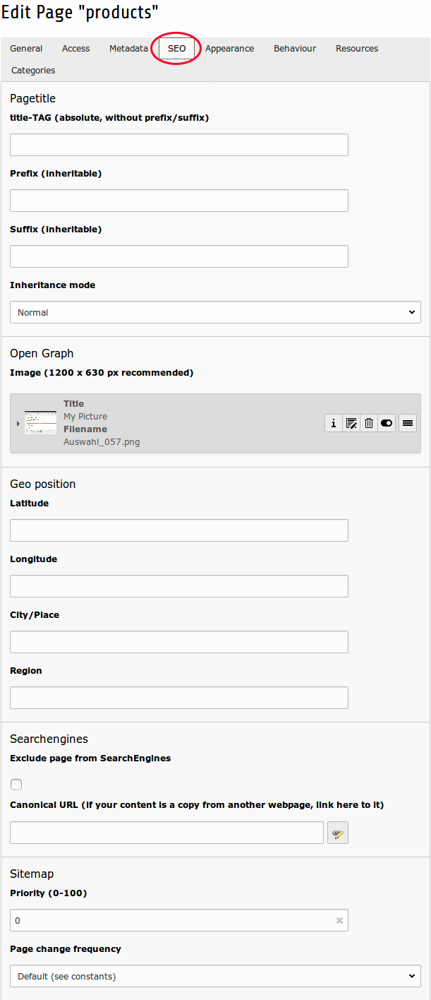
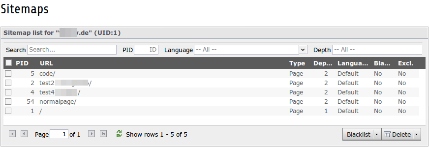

.. ==================================================
.. FOR YOUR INFORMATION
.. --------------------------------------------------
.. -*- coding: utf-8 -*- with BOM.

.. include:: ../Includes.txt

What does it do?
================

This extensions handles multiple page metatags and pagetitle manipulations in TYPO3. It's a replacement and major improvement for the “metatags” and this extension is the successor of the popular "tq_seo" extension.

The following features are supported:

- Indexed XML sitemap for Google and other search engines (with support for ALL extensions, pibase and extbase, not only tt_news)
- Real sitemap builder via TYPO3 scheduler
- Metatags
- Manipulation of Metatags via stdWrap (Beta)
- Automatic fetching metatags from tt_news (single-display module)
- Pagetitle manipulations
- Manipulation of pagetitle via stdWrap (Beta)
- Multi-language and/or multi-tree TYPO3 installations

The following metatags are supported:

- Language (auto-detected)
- Description
- Keyword
- Copyright information
- Reply-To E-Mail-Address
- Author and publisher
- Rating and distribution
- Revisit
- Geo-location information
- Searchengine crawler instructions
- Google Analytics (asynchronous, with anonymized IP and download link tracking)
- Piwik integration (asynchronous)
- Google, MSN, Yahoo and WebOfTrust Verification
- Google+ Direct Connect
- Canonical URL (custom URL or autogenerated for current page)
- IE Compatibility-Mode
- Google Expire Date
- Index, up, prev und next link-metatags
- P3P-HTTP-Headers
- OpenGraph (WIP)
- Blacklist for sitemap, CanonicalURL and searchengine index/noindex switching

The following pagetitle transformations are supported:

- Prefix and suffix (inheritable)
- Absolute pagetitle without any prefix and suffix
- Sitetitle glue options
- Sitetitle positon

Backend modules:

- SEO page module
- SEO control center module
- SEO sitemap module

Screenshots
-----------

SEO section in page properties
^^^^^^^^^^^^^^^^^^^^^^^^^^^^^^

    Page Properties "SEO"

Backend Modules
^^^^^^^^^^^^^^^
.. figure:: ../Images/Introduction/ModuleSeoMetatags.png
    :scale: 80%
    :alt: Backend Module - SEO Metatags

    Backend Module "SEO Metatags"

.. figure:: ../Images/Introduction/ModuleSeoControlCenter.png
    :scale: 80%
    :alt: Backend Module - SEO Control Center

    Backend Module "SEO Control Center"

.. figure:: ../Images/Introduction/ModuleSeoSitemap.png
    :scale: 80%
    :alt: Backend Module - SEO Sitemap

    Backend Module "SEO Sitemap"

    Backend Module "SEO Sitemap" detail view

Getting started
---------------

This is a quick overview to get started using MetaSEO. For details, please have a look at the other chapters
of this manual.

The basic steps to use MetaSEO are:

- Install the extension and include MetaSEO's static template
- Make sure a root page exists (can be set in page properties)
- Make sure a domain record exists (add new domain record in your root page)
- Now you can enable and configure MetaSEO's features via TYPO3's constant editor (e. g. for a root page)
- Edit SEO related data either in section SEO in the page properties or via Metatags/SEO icon on the left pane

To let MetaSEO create XML sitemaps to be fetched by search engines, enable this feature for each
root page via MetaSEO's Control Center. MetaSEO handles two ways to pass the sitemap to a search engine:

- Generated at runtime, based on MetaSEO's sitemap index. This is already ways faster than letting TYPO3 traverse
  the whole page tree. The corresponding URL can be taken from the sitemap preview in the Control Center. It can
  be added to a `robots.txt` file in order to specify a sitemap and/or be passed to a search engine manually.
- Let MetaSEO's scheduler task write the sitemap to files. Once again, this is pretty fast because the scheduler
  task relies on MetaSEO's sitemap index. Using this feature lets you define when exactly
  an updated sitemap gets visible to search engines. On-top, sitemaps become available as static content which
  takes pretty much zero calculation time when search engines fetch it.

To see sitemap indexing in action, log out from TYPO3's backend and request some of your web pages to let
MetaSEO index them. Good to know: MetaSEO makes use of TYPO3's caching architecture which reduces calculation
time to a minimum, once a page is indexed.

As a bonus, MetaSEO also lets you create, manipulate and preview a robots.txt file via MetaSEO's Control Center.
To actually use it, let your web server point to it via web server configuration (e.g. `.htaccess` file) or let
MetaSEO's scheduler task write the `robots.txt` to a file and point to it using a symlink.

Another good place to start with is this step by step `video tutorial (German) <https://jweiland.net/video-anleitungen/typo3/interessante-typo3-extensions/metaseo.html>`_
which is provided by jweiland.net.

Found a bug?
------------

Just send a mail to typo3@markus-blaschke.de
or file an issue at `github <https://github.com/webdevops/TYPO3-metaseo>`_
or ask MetaSEO's `slack channel <https://typo3.slack.com/messages/ext-metaseo/>`_

Thanks to...
------------

- TEQneers GmbH & Co. KG for sponsoring the predecessor "tq_seo"
- `2bis10 IT-Services UG (haftungsbeschränkt) <https://www.2bis10.de>`_ for sponsoring community support and large portions of the code in 2.x and 3.x releases
- jweiland.net and especially Wolfgang Wagner for their `video tutorial (German) <https://jweiland.net/video-anleitungen/typo3/interessante-typo3-extensions/metaseo.html>`_
- Anton Danilov
- Pierre Arlt
- Riccardo De Contardi
- Rico Sonntag
- Ralle Büchnitz
- Manfred Egger
- Carsten Hager
- Thomas Deuling
- Thomas Mayer // `2bis10 IT-Services UG (haftungsbeschränkt) <https://www.2bis10.de>`_
- Florian Duffner
- Georg Tiefenbrunn
- Arne-Kolja Bachstein
- Paul-Christian Volkmer
- Dominik Steinborn
- Attila Glück
- Alexander Grein
- Simon Schaufelberger
- Marcus Müller
- Manuel Munz
- Mario Näther
- Birger Stöckelmann
- all other contributors and bug reporters
- famfamfam for these cool silk icons http://www.famfamfam.com/lab/icons/silk/
