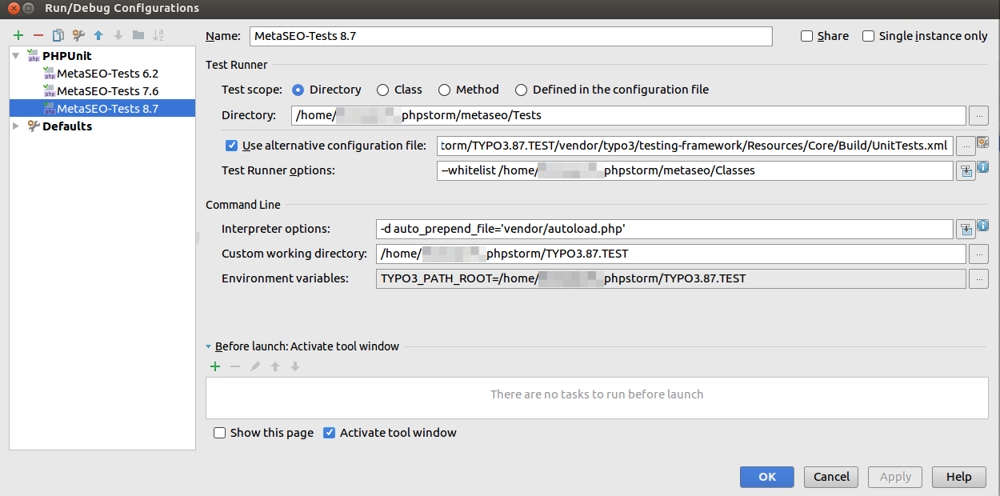
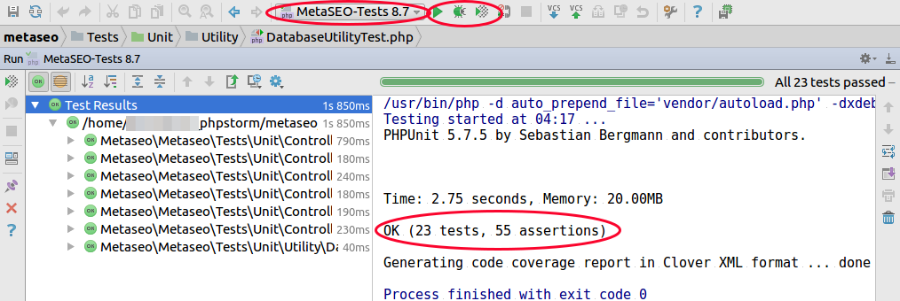
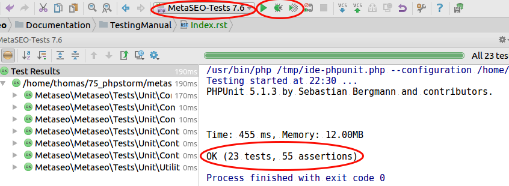

.. ==================================================
.. FOR YOUR INFORMATION
.. --------------------------------------------------
.. -*- coding: utf-8 -*- with BOM.

.. include:: ../Includes.txt

.. _testing-manual:

Testing Manual
==============

This section is written for developers who want to contribute new test cases to MetaSEO itself or just
want to test their changes against regressions.

Please note that MetaSEO's test cases slightly differ from the way test cases are written in the TYPO3 core.
For the moment, our test cases can just be directly run in an IDE like PhpStorm, ignoring the fact that TYPO3
provides additional infrastructure which we currently don't use.

The test suite currently even avoids to test components from the core, which in turn means that the test suite
contains unit tests only whereas core components are mocked as far as possible.

Setting up the test suite for MetaSEO 3.x
-----------------------------------------

Prerequisites
^^^^^^^^^^^^^

You need to install

* PHP 7.0+ to test against TYPO3 8.7
* php-cli, php-curl, php-gd, php-intl, php-mysql, php-zip, curl, xdebug
* Latest version of composer
* PHPUnit (to resolve dependencies)

Using ubuntu 16.04, that could look like this:

::

    sudo su - root
    apt-get install php7.0-cli php7.0-curl php7.0-gd php7.0-intl php7.0-mysql php7.0-zip php-xdebug phpunit curl
    curl -sS https://getcomposer.org/installer | php -- --install-dir=/usr/local/bin --filename=composer

Testing MetaSEO 3.x against TYPO3 CMS 8.7
^^^^^^^^^^^^^^^^^^^^^^^^^^^^^^^^^^^^^^^^^

Starting with TYPO3 CMS 8.7, we can make use of TYPO3's testing framework which integrates nicely
into an IDE like PHPStorm as described in the following steps:

Clone TYPO3 sources, install dependencies and manually symlink to your MetaSEO directory:

::

    git clone --single-branch --branch TYPO3_8-7 https://github.com/TYPO3/TYPO3.CMS.git TYPO3.87.TEST
    cd TYPO3.87.TEST
    composer install -o
    mkdir -p typo3conf/ext
    cd typo3conf/ext
    ln -s ../../../metaseo

In your IDE, add another PHPUnit test configuration. The IDE needs to know a few things:

* PHPUnit should execute only tests in directory `metaseo/Tests`.
* PHPUnit should use the configuration file `UnitTests.xml` which is provided by TYPO3.
* A PHPUnit parameter `--whitelist` is needed to specify a directory to report code coverage for.
* TYPO3's testing framework needs to know TYPO3's root directory which can be specified in an
  environment variable `TYPO3_PATH_ROOT`
* PHP CLI should know which classes must be loaded whereas composer's autoloader does the job
  by passing a parameter `-d auto_prepend_file='vendor/autoload.php'` to PHP CLI.
* A working directory to `cd` into. That should be TYPO3's root directory again.

In PhpStorm 2017.1.1, the configuration looks like this:

    You can now run the tests of the test suite by choosing the new test configuration and pressing the run button.

    In case of success, the result should more or less look like this:

    As an alternative, the test suite can also be run via command line interface:

::

    cd TYPO3.87.TEST
    ./bin/phpunit  --configuration vendor/typo3/testing-framework/Resources/Core/Build/UnitTests.xml ../metaseo/Tests

That should return an output like

::

    PHPUnit 5.7.5 by Sebastian Bergmann and contributors.
    .......................  23 / 23 (100%)
    Time: 601 ms, Memory: 16.00MB
    OK (23 tests, 55 assertions)

Setting up the test suite for MetaSEO 2.x
-----------------------------------------

Prerequisites
^^^^^^^^^^^^^

You need to install

* PHP 5.6 or PHP 7.0.16 to test against TYPO3 6.2 or 7.6
* php-cli, php-curl, php-gd, php-intl, php-mysql, php-zip, curl
* Latest version of composer
* PHPUnit 5.1.3 or use the PHPUnit version shipped with TYPO3 CMS (e.g. PHPUnit 4.8.29)

Using ubuntu 16.04, that could look like this:

::

    sudo su - root
    apt-get install php7.0-cli php7.0-curl php7.0-gd php7.0-intl php7.0-mysql php7.0-zip phpunit curl
    curl -sS https://getcomposer.org/installer | php -- --install-dir=/usr/local/bin --filename=composer

Testing MetaSEO 2.x against TYPO3 CMS 7.6
^^^^^^^^^^^^^^^^^^^^^^^^^^^^^^^^^^^^^^^^^

Clone TYPO3 sources, install dependencies and manually symlink to your MetaSEO directory:

::

    git clone --single-branch --branch TYPO3_7-6 https://github.com/TYPO3/TYPO3.CMS.git TYPO3.76.TEST
    cd TYPO3.76.TEST
    composer install -o
    mkdir -p typo3conf/ext
    cd typo3conf/ext
    ln -s ../../../metaseo

In your IDE, add another PHPUnit test configuration. The IDE should know, that you want to run the tests
in `metaseo/Tests` and that you want to use the configuration file which is provided by TYPO3.

In PhpStorm, the configuration looks like this:

.. figure:: ../Images/TestingManual/IDETestConfiguration.png
    :scale: 80%
    :alt: Adding a test configuration in PhpStorm

You can now execute the test by choosing the new test configuration and pressing the run button.

In case of success, the result should more or less look like this:

As an alternative, the test suite can also be run via command line interface:

::

    cd TYPO3.76.TEST
    ./bin/phpunit  --configuration typo3/sysext/core/Build/UnitTests.xml ../metaseo/Tests

That should return an output like

::

    PHPUnit 4.8.29 by Sebastian Bergmann and contributors.
    .......................
    Time: 378 ms, Memory: 12.00MB
    OK (23 tests, 55 assertions)

Testing MetaSEO 2.x against TYPO3 CMS 6.2
^^^^^^^^^^^^^^^^^^^^^^^^^^^^^^^^^^^^^^^^^

To test against TYPO3 6.2, only version specific changes must be applied. In case of newer PHP versions
like e.g. PHP7+, you have to apply `--ignore-platform-reqs` to the composer command. The test suite is
known to work with PHP 5.6 and PHP 7.0.16 at least.

::

    git clone --single-branch --branch TYPO3_6-2 https://github.com/TYPO3/TYPO3.CMS.git TYPO3.62.TEST
    cd TYPO3.62.TEST
    composer install --ignore-platform-reqs -o
    mkdir -p typo3conf/ext
    cd typo3conf/ext
    ln -s ../../../metaseo

Running the test suite works exactly the same as described in the 7.6 section.

Testing the documentation for syntax errors
-------------------------------------------

As soon as you have installed python-sphinx, you can test the rst files of the documentation for syntax errors
and preview the rendered html output in a browser of your choice:

::

    sudo apt-get install python-sphinx # when using debian or ubuntu
    cd metaseo/Documentation/_make
    make html
    firefox build/html/Index.html

The rst files are known to render with Sphinx v1.3.6 at least.
